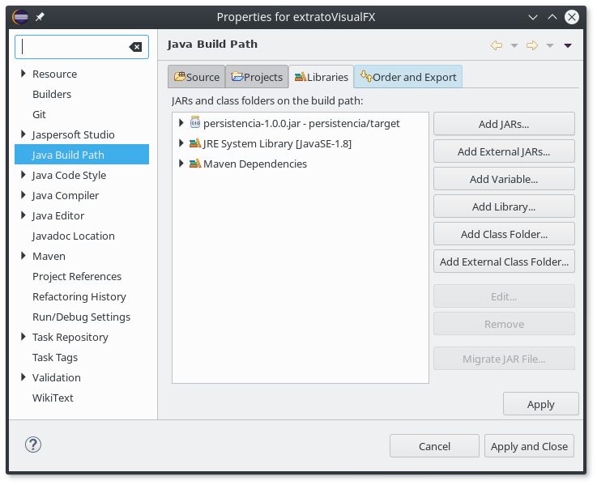
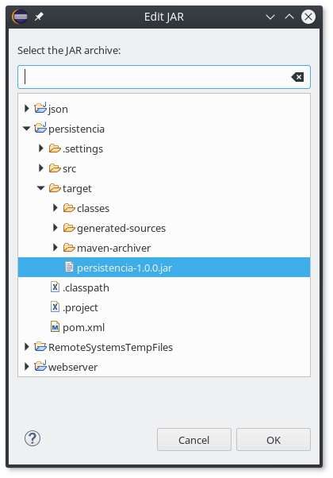
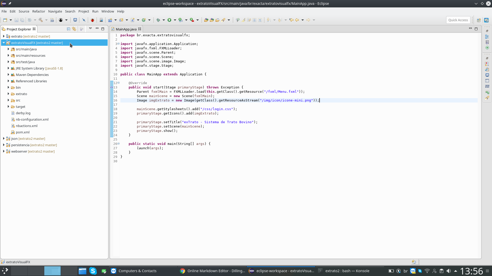
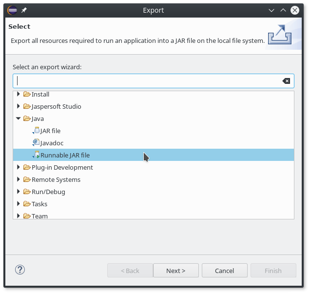
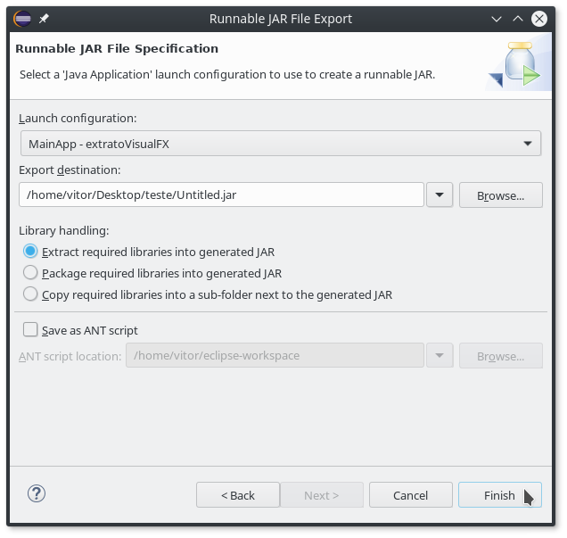

# Gerar JAR executável usando Eclipse

1. Adicionar o Persistencia.jar como dependência do projeto:
Project / Properties / Java Build Path / Libraries / 

1. "Add JARs..." selecionar o arquivo jar no projeto "persistencia/target/"

1. Fazer checkout no branch "release"
`git checkout release`

1. Clicar com o botão direito em "extratoVisualFX" e em seguida "Exportar..."

1. Selecionar "Java / Runnable JAR file"

1. Na tela seguinte "Extract required libraries into generated JAR" e "Finish"

